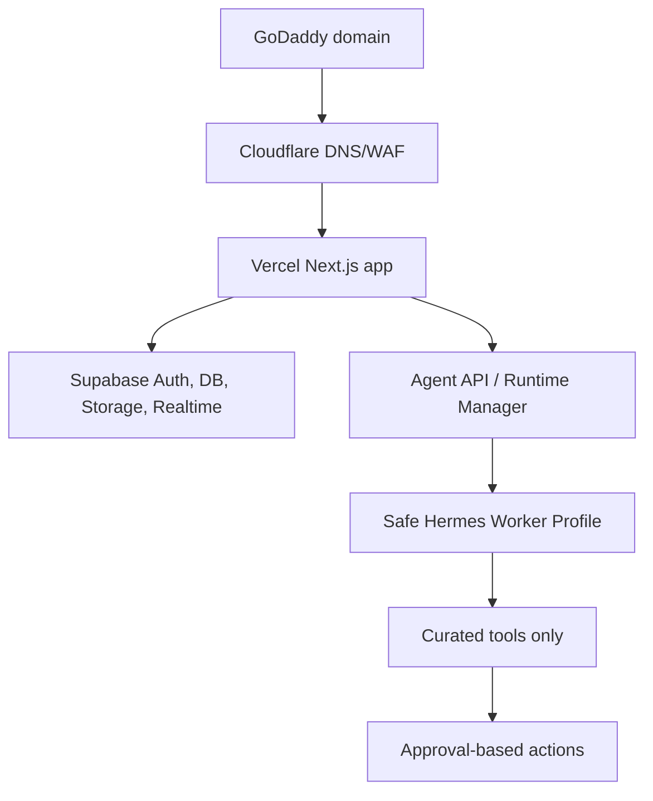

# Architecture

AgenticOS separates the consumer SaaS surface from the agent execution engine.

The frontend never calls Hermes directly. It calls a small API layer that validates the user, workspace,
mode, plan, connection scopes, and approval state before anything reaches a worker.
